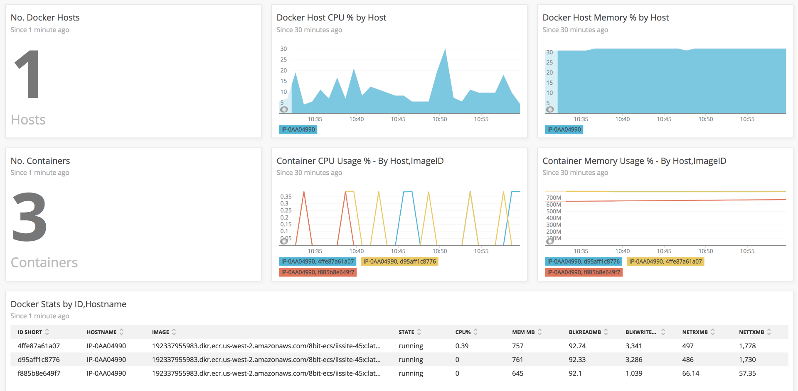

# Docker OHI

#### Uses V3 Golang Infra SDK & Docker Golang SDK

### [Download The Latest Release HERE](https://source.datanerd.us/FIT/docker-ohi/releases/latest)

- Basically collects "docker stats" info rather then "docker inspect", and collects some extra info (throttling, network etc.)
- Supports docker on windows, and linux
- Requirements: Must run on Docker host



### Config:
```
api: "1.37" <- Set Docker API Version
exclude: PreviousCPU,PreviousSystem <- Exclude anything you don't want
```

### Linux

Download the latest release, and run install_linux.sh with Administrative permissions.
Run chmod +x install_linux.sh on the file incase of any permission issues.

Else, modify install_linux.sh script with paths to suit or copy files as below instructions:

```
Copy files into following locations:
cp ./docker-ohi-config.yml /etc/newrelic-infra/integrations.d/
cp ./docker-ohi-definition.yml /var/db/newrelic-infra/custom-integrations/
- - Ensure/Update "os" to "linux" and check that under command section it is docker-ohi && NOT docker-ohi.exe

cp ./docker-config.yml /var/db/newrelic-infra/custom-integrations/
cp ./bin/docker-ohi /var/db/newrelic-infra/custom-integrations/
```

### Windows Install

Download the latest release, and run install_win.bat with Administrative permissions.
Else, modify install_win.bat script with paths to suit or copy files as below instructions:

```
Copy files into following locations:

Program Files/newrelic-infra/custom-integrations/
- docker-ohi-definition.yml 
- - Ensure/Update "os" to "linux" and check that under command section it is docker-ohi.exe && NOT "docker-ohi" without the extension
- docker-config.yml
- docker-ohi.exe

Program Files/newrelic-infra/integrations.d/
- docker-ohi-config.yml
```

### Compiling
```
Set GOOS as required before compilation and run 'make'
```
Tests will fail if compiling for different platform.